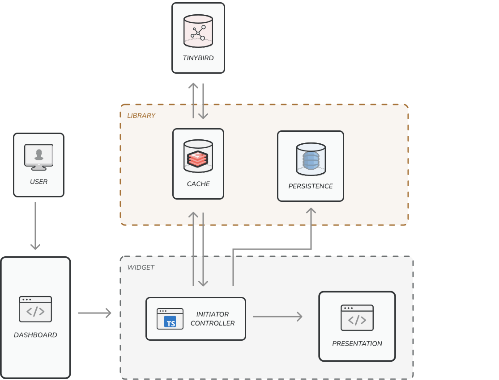

# Joaquin Marti's TB widget test

## Requirements

[Node](https://nodejs.org/)

This projects asumes the Node version is `v14.17.6` but any modern version will work.

If you have [NVM](https://github.com/creationix/nvm) execute this command in the repository folder for every new terminal session to make sure the Node version matches with the environment.

```
nvm use
```

## Commands

### Install dependencies

```
npm install
```

### Start dev environment

```
npm run dev
```

### Build production version

```
npm run build
```

### Execute tests

```
npm run test
```

## Description

This repository contains a single page as a Dashboard with a widget consuming a Tinybird endpoint. The widget shows the endpoint data in an SVG chart and has deeplinked filters to render different metrics.

## Production URL

The project is deployed in this URL:

[https://rad-kringle-6bf302.netlify.app/](https://rad-kringle-6bf302.netlify.app/)

## Technical solution

A widget is by default a standalone element that can be added to any website. A site could contain several widgets, including more than one instance of the same one. Even though the purposes of every widget might be very different, they  likely would share similar needs: access to data, caching, persistence, and eventually other features.

Considering the previous assumptions, the technical solution is divided in three main elements:

- A presentational layer as a web component. It is data agnostic, so it could render different metrics, scales and filters.
- An initiator with specific code to start a single instance of a widget. It behaves as the widget instance controller. It access the data and sends it to the presentational layer.
- A library solving common needs: a mechanism to request API endpoints, cache the data and a persistence layer to handle the state in the URL.

## Stack

The stack is based on web standards, no external dependencies needed. The involved standards are:

- Web component APIs: Custom elements and Shadow dom.
- SVG
- HTML
- CSS
- Javascript (Typescript)

## Architecture

The following diagram illustrates the general architecture of the picture.



- The site contains a widget.
- The widget is composed by the initiator/controller and the presentational layer.
- The initiator requests the data to the Tinybird endpoint and caches it. Later requests will not hit the endpoint.
- The persistence layer saves the filters states after every user action. In this widget, the persistence layer saves the state in the query params URL but other mechanisms could be easily done implementing the same interface: cookie, local storage, memory, remote database...

### Testing

A thin layer of unit testing has been implemented. The current coverage includes the whole library and the web component helpers. More tests could be added to cover the web component rendering, and another set of e2e tests could cover the whole widget behavior.

### Extra ball

This repository also contains a mechanism to load widgets out of a small snippet of code. The snippet loads the Javascript files, the web component and the initiator, to bootstrap an instance of a widget.

```
<script>
  (function (w, d, s, ce, ceid) {
    var f = d.currentScript, l = d.createElement(s), w = d.createElement(s), wdi = d.createElement(ce); wdi.setAttribute("id", ceid);
    w.src = "/chart-8f3aed33e0510dc4122f.js";
    l.src = "/init-a76254050987ffbb8447.js";
    l.defer = true; f.parentNode.insertBefore(wdi, f); f.parentNode.insertBefore(w, f); f.parentNode.insertBefore(l, f);
  })(window, document, "script", "tbw-chart", "chart");
</script>
```

The snippet allows external sites to load widgets, despite the framework used in the site, as the widgets are based on web standards (javascript, web components, svg) and they don't need any external dependency. The script tag loading the widget does not get loaded in the critical path to avoid afecting the site core web vitals metric.

En example can be found here:

[https://rad-kringle-6bf302.netlify.app/snippet.html](https://rad-kringle-6bf302.netlify.app/snippet.html)